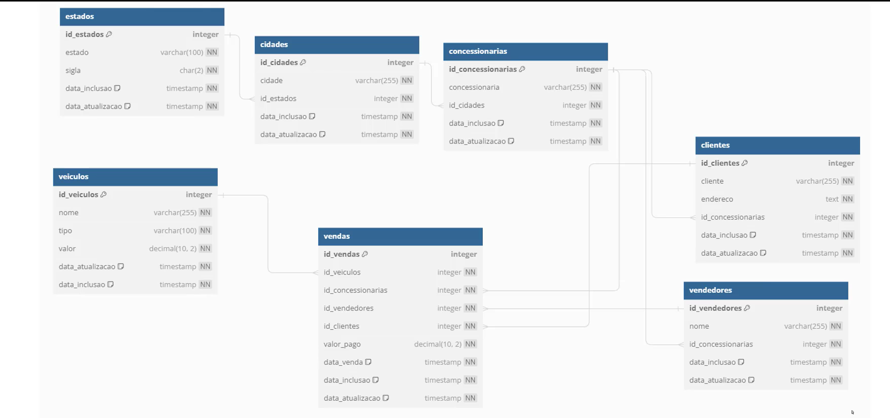
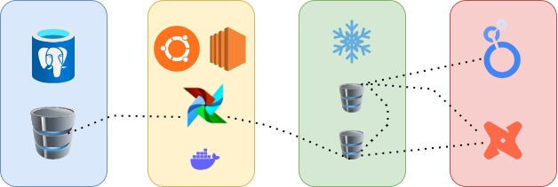

# Projeto de Engenharia de Dados para Concessionárias de Veículos

## Visão Geral

Este projeto demonstra um pipeline de dados robusto desde a ingestão até a visualização para uma empresa de veículos com várias concessionárias no Brasil. O pipeline automatiza a ingestão de dados de um banco de dados PostgreSQL, armazena os dados no Snowflake, realiza transformações com DBT e visualiza os dados no Google Data Studio.

## Objetivo
Este projeto tem como objetivo modernizar a estrutura de dados existente da NovaDrive para facilitar a gestão e análise de vendas de veículos, utilizando novas tecnologias de engenharia de dados.

## Descrição do Problema
A NovaDrive enfrenta desafios na gestão e análise de seus dados de vendas de veículos armazenados no PostgreSQL, necessitando de uma solução mais robusta e eficiente para suportar análises avançadas e operações escaláveis.

## Considerações Finais
Este projeto visa modernizar a infraestrutura de dados da NovaDrive, permitindo uma gestão mais eficiente e análises mais profundas das vendas de veículos. Com a implementação de tecnologias modernas de engenharia de dados, a empresa estará preparada para escalar suas operações e obter insights estratégicos de forma ágil e precisa.

## Estrutura do Repositório

- **[1_data_analysis/](1_data_analysis/)**: Scripts e descrições relacionados à análise da estrutura do banco de dados PostgreSQL.
- **[2_ec2_setup/](2_ec2_setup/)**: Scripts de configuração do servidor EC2, configuração do Docker e DAGs do Airflow.
- **[3_data_warehouse/](3_data_warehouse/)**: Scripts para configuração e carregamento de dados no Snowflake.
- **[4_data_transformation/](4_data_transformation/)**: Projeto DBT para transformação de dados.
- **[5_visualization/](5_visualization/)**: Documentação das visualizações criadas no Google Data Studio.

## Arquitetura

### Arquitetura do Banco de Produção (PostgreSQL)
*Nesse script os dados de acesso ao banco de dados não serão fornecidos*

### Arquitetura da Engenharia de Dados

### Resumo Detalhado da Arquitetura de Dados
**1. Coleta de Dados:**

*Fonte de Dados:* Os dados são coletados de um banco de dados PostgreSQL, que armazena informações de vendas em tempo real de uma empresa de veículos com várias concessionárias no Brasil.
*Estrutura do Banco de Dados:* O banco de dados PostgreSQL é composto pelas tabelas veiculos, estados, cidades, concessionarias, vendedores, clientes, e vendas.

**2. Orquestração e Automação com Airflow:**

*Configuração do Servidor:* Um servidor EC2 com Ubuntu é configurado para hospedar o Airflow em um contêiner Docker.
DAGs do Airflow: São criados gráficos acíclicos direcionados (DAGs) no Airflow para orquestrar o processo de carregamento de dados.
*Carga Incremental:* As DAGs são responsáveis por executar a carga incremental dos dados do PostgreSQL para o Snowflake, garantindo que apenas novas atualizações sejam capturadas.
*Agendamento:* O Airflow é agendado para executar periodicamente, garantindo a ingestão contínua e atualizada dos dados.

**3. Armazenamento no Data Warehouse:**

*Snowflake:* O Snowflake é utilizado como o serviço de armazenamento de dados na nuvem.
*Área de Stage:* Os dados carregados pelo Airflow são inicialmente armazenados na área de stage do Snowflake, onde permanecem até serem transformados.

**4. Transformação de Dados com DBT:**

*DBT (Data Build Tool):* O DBT é utilizado para transformar os dados no Snowflake.
*Modelagem de Dados:* No DBT, os dados são modelados, refinados e testados para garantir a qualidade e a integridade dos dados.
*Schema de Desenvolvimento:* As transformações iniciais são aplicadas em um schema de desenvolvimento, permitindo testes e validações antes da promoção para produção.
*Área de Analytics:* Após a transformação e validação, os dados refinados são movidos para a área de analytics no Snowflake, onde estão prontos para consumo.

**5. Visualização de Dados:**

*Google Data Studio:* As visualizações e dashboards são criados utilizando o Google Data Studio.
*Consumo de Dados:* O Google Data Studio consome diretamente os dados da área de analytics do Snowflake, permitindo a criação de relatórios interativos e dashboards que oferecem insights valiosos sobre as vendas e operações das concessionárias.

### Fluxo Resumido
**PostgreSQL:** Coleta de dados em tempo real.
**Airflow:** Orquestração de DAGs para carga incremental de dados.
**Snowflake (Stage):** Armazenamento inicial dos dados carregados.
**DBT:** Transformação e modelagem de dados.
**Snowflake (Analytics):** Armazenamento de dados transformados para consumo.
**Google Data Studio:** Criação de dashboards e visualizações.
Essa arquitetura permite uma pipeline de dados robusta e eficiente, garantindo que os dados estejam sempre atualizados, bem transformados e prontamente disponíveis para análise e visualização.

## Passo a Passo

Instruções detalhadas sobre como foi configurado e executado o projeto.

1. **Análise do Banco de Dados**: [1_data_analysis/](1_data_analysis/)
2. **Configuração do EC2 e Airflow no Docker**: [2_ec2_setup/](2_ec2_setup/)
3. **Armazenamento dos Dados no Snowflake**: [3_data_warehouse/](3_data_warehouse/)
4. **Transformação de Dados com DBT**: [4_data_transformation/](4_data_transformation/)
5. **Visualizações no Google Data Studio**: [5_visualization/](5_visualization/)
